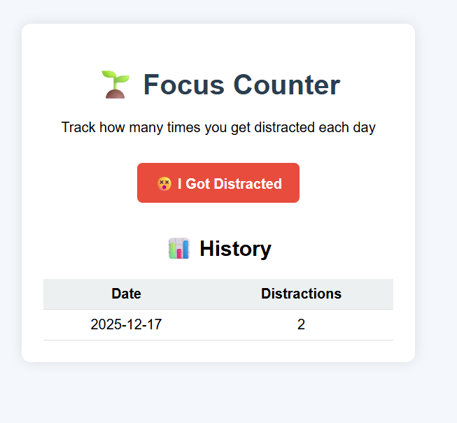

# 🌱 Focus Counter – Distraction Tracker

Focus Counter is a minimal and unique web application designed to help students become aware of their distractions. Instead of complex productivity tools, this app focuses on one simple action: counting how many times you get distracted each day.

Every time you feel distracted, you click a button — the app automatically records and updates the count for the current date using SQLite.

---

## ✨ Project Purpose

The goal of this project is to:
- Encourage self-awareness about distractions
- Keep the system extremely simple and lightweight
- Demonstrate practical use of SQLite with Flask
- Avoid unnecessary features like login systems or heavy UI

---

## 🧠 How It Works

- The application tracks distractions **per day**
- When the button is clicked:
  - If today’s date already exists → the count increases
  - If today’s date does not exist → a new record is created
- All data is stored locally using **SQLite**

---

## 🛠️ Technologies Used

- Python
- Flask
- SQLite
- HTML
- CSS

---

## 📊 Data Storage

The app uses a single SQLite table to store:
- Date
- Number of distractions for that date

This ensures persistence without the need for external databases or configuration.

---

## 🎯 Key Highlights

- Unique and practical concept
- Very small and readable codebase
- No authentication or external dependencies
- Perfect for beginners learning Flask + SQLite
- Suitable for academic projects and portfolios

---
## 🎯 Key Highlights

---

## 🚀 Use Case

Ideal for:
- Students who want to monitor focus habits
- Beginners learning backend + database integration
- Demonstrating clean SQLite usage in a Flask app

---

## 🌟 Outcome

By using this app regularly, users gain insight into their distraction patterns and can gradually improve their focus and productivity through awareness.

---
